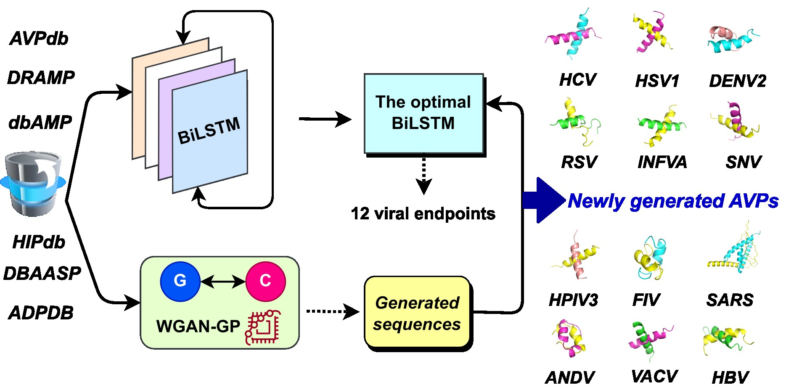

# A Hybrid Framework of Generative Deep Learning for Antiviral Peptide Discovery

#### Huynh Anh Duy*, Tarapong Srisongkram** 

*Graduate School in the Program of Research and Development in Pharmaceuticals, Pharmaceutical Sciences, Faculty of Pharmaceutical Sciences, Khon Kaen University, Thailand. 

Department of Health Sciences, College of Natural Sciences. Can Tho University, Vietnam. (huynhanhduy.h@kkumail.com; haduy@ctu.edu.vn)

**Division of Pharmaceutical Chemistry, Faculty of Pharmaceutical Sciences, Khon Kaen University, Thailand. (tarasri@kku.ac.th)
Source codes and dataset is available in this repository.

#### Package version
Rdkit: v.2024.9.4; Scikit-learn: v1.5.2; Tensorflow: v2.17.0; Numpy: v.1.26.4.

BioPython: v1.82; MEME (Multiple Em for Motif Elicitation) v5.5.7.
